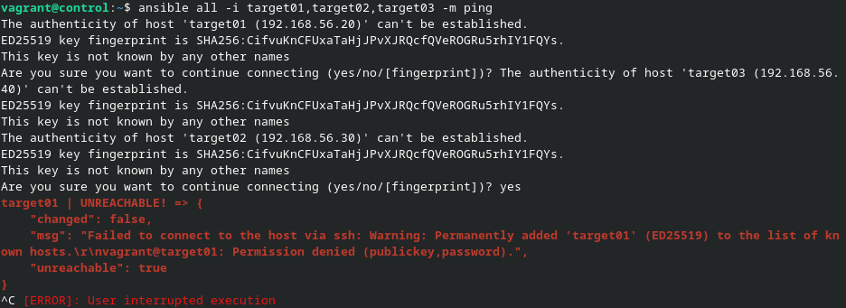
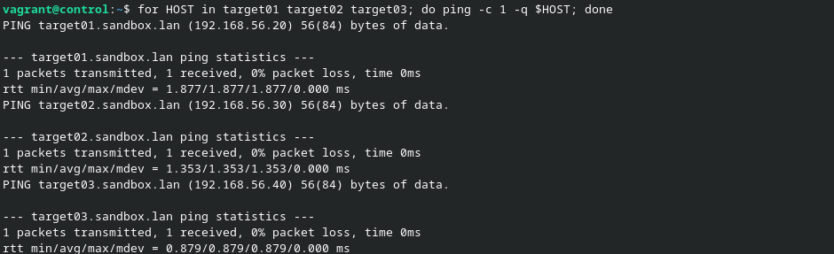
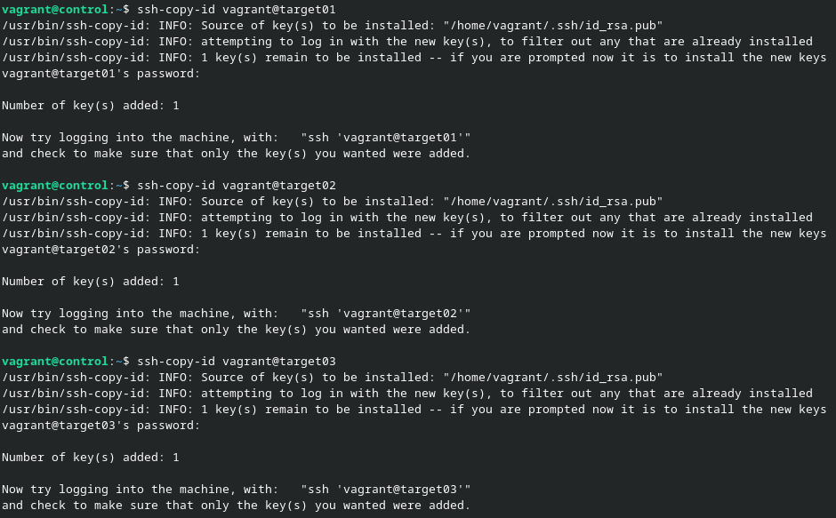

# À vous de jouer !

- Placez-vous dans le répertoire du troisième atelier pratique.

```sh
cd ~/formation-ansible/atelier-03
```

- Voici les quatre machines virtuelles Ubuntu 22.04 de cet atelier.

  | Machine virtuelle | Adresse IP    |
  | :---------------- | :------------ |
  | control           | 192.168.56.10 |
  | target01          | 192.168.56.20 |
  | target02          | 192.168.56.30 |
  | target03          | 192.168.56.40 |

- Démarrez les VM.

```sh
vagrant up
```

- Connectez-vous au _Control Host_.

```sh
vagrant ssh control
```

- Ansible est déjà installé sur cette machine.

```sh
type ansible
```

- Ajoutez les adresses et les noms d'hôtes au _Control Host_.

```sh
sudo nano /etc/hosts
```

```
192.168.56.10   ansible.sandbox.lan     control
192.168.56.20   target01.sandbox.lan    target01
192.168.56.30   target02.sandbox.lan    target02
192.168.56.40   target03.sandbox.lan    target03
```

- Testez l'authentification sur les _Target Hosts_

```sh
ansible all -i target01,target02,target03 -m ping
```

Les connexions échouent.


- Testez la connectivité aux machines.

```sh
for HOST in target01 target02 target03; do ping -c 1 -q $HOST; done
```

Les pings réussissent.


- Collectez les clés SSH publiques des _Target Hosts_.

```sh
ssh-keyscan -t rsa target01 target02 target03 >> .ssh/known_hosts
```

- Testez les connexions ssh.

```sh
ssh target01
ssh target02
ssh target03
```

Les 3 connexions fonctionnent.

- Générez une paire de clés SSH.

```sh
ssh-keygen
```


- Distribuez la clé publique aux _Target Hosts_.

```sh
ssh-copy-id vagrant@target01
ssh-copy-id vagrant@target02
ssh-copy-id vagrant@target03
```



- Testez de nouveau l'authentification sur les _Target Hosts_

```sh
ansible all -i target01,target02,target03 -m ping
```

Les connexions réussissent.

