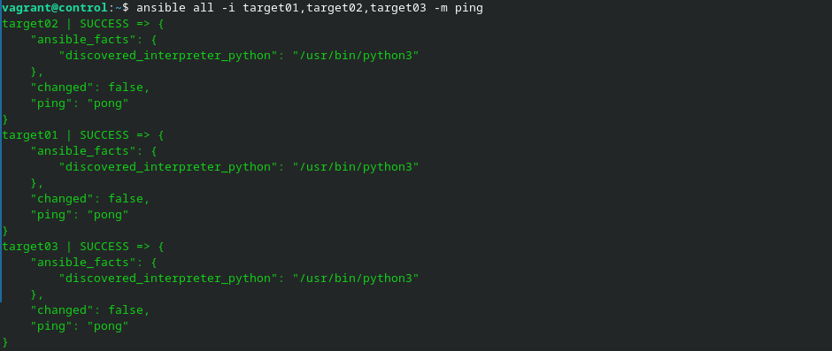
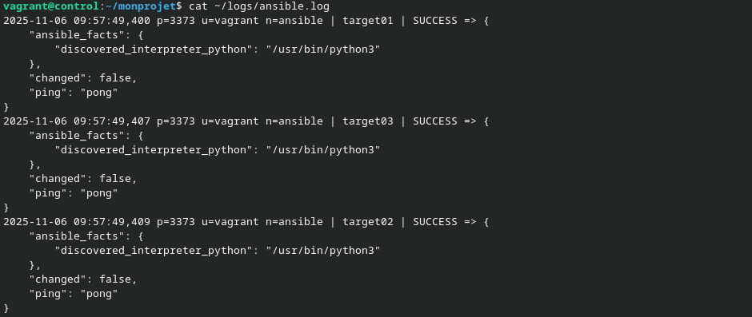

# À vous de jouer !

- Démarrez les VM.

```sh
vagrant up
```

- Connectez-vous au _Control Host_.

```sh
vagrant ssh control
```

- Éditez `/etc/hosts` de manière à ce que les _Target Hosts_ soient joignables par leur nom d'hôte simple.

```sh
sudo nano /etc/hosts
```

```
192.168.56.10   ansible.sandbox.lan     control
192.168.56.20   target01.sandbox.lan    target01
192.168.56.30   target02.sandbox.lan    target02
192.168.56.40   target03.sandbox.lan    target03
```

- Configurez l'authentification par clé SSH avec les trois _Target Hosts_.

```sh
ssh-keyscan -t rsa target01 target02 target03 >> .ssh/known_hosts
ssh-keygen
ssh-copy-id vagrant@target01
ssh-copy-id vagrant@target02
ssh-copy-id vagrant@target03
```

- Installez Ansible.

```sh
sudo apt update
sudo apt install -y ansible
```

- Envoyez un premier `ping` Ansible sans configuration.

```sh
ansible all -i target01,target02,target03 -m ping
```

Les connexions réussissent.


- Créez un répertoire de projet `~/monprojet`.

```sh
mkdir ~/monprojet
```

- Créez un fichier vide `ansible.cfg` dans ce répertoire.

```sh
cd monprojet
touch ansible.cfg
```

- Vérifiez si ce fichier est bien pris en compte par Ansible.

```sh
ansible --version | head -n 2
```

Le fichier est bien pris en compte par Ansible.

```
ansible 2.10.8
  config file = /home/vagrant/monprojet/ansible.cfg
```

- Spécifiez un inventaire nommé `hosts`.

```sh
nano ansible.cfg
```

```
[defaults]
inventory = ./hosts
```

- Activez la journalisation dans `~/journal/ansible.log`.

```sh
mkdir -v ~/logs
nano ansible.cfg
```

```
log_path = ~/logs/ansible.log
```

- Testez la journalisation.

```sh
ansible all -i target01,target02,target03 -m ping
cat ~/logs/ansible.log
```

La journalisation fonctionne.


- Créez un groupe `[testlab]` avec vos trois _Target Hosts_.

```sh
nano hosts
```

```
[testing]
target01
target02
target03
```

- Définissez explicitement l'utilisateur `vagrant` pour la connexion à vos cibles.

```sh
nano hosts
```

```
[testing:vars]
ansible_user=vagrant
```

- Envoyez un ping Ansible vers le groupe de machines `[all]`.

```sh
ansible all -m ping
```

Les pings réussissent.


- Définissez l'élévation des droits pour l'utilisateur vagrant sur les _Target Hosts_.

```sh
nano hosts
```

```
ansible_become=yes
```

- Affichez la première ligne du fichier `/etc/shadow` sur tous les _Target Hosts_.

```sh
ansible all -a "head -n 1 /etc/shadow"
```


- Quittez le _Control Host_ et supprimez toutes les VM de l'atelier.

```sh
exit
vagrant destroy -f
```
